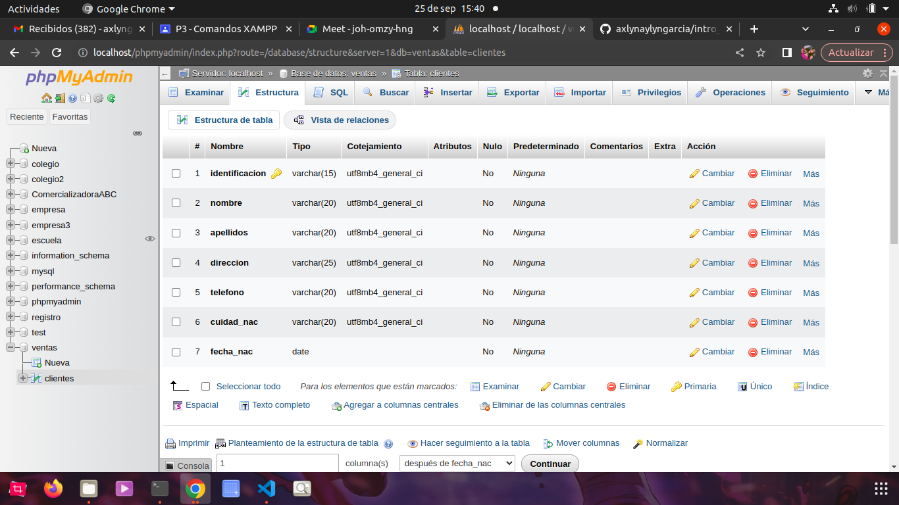
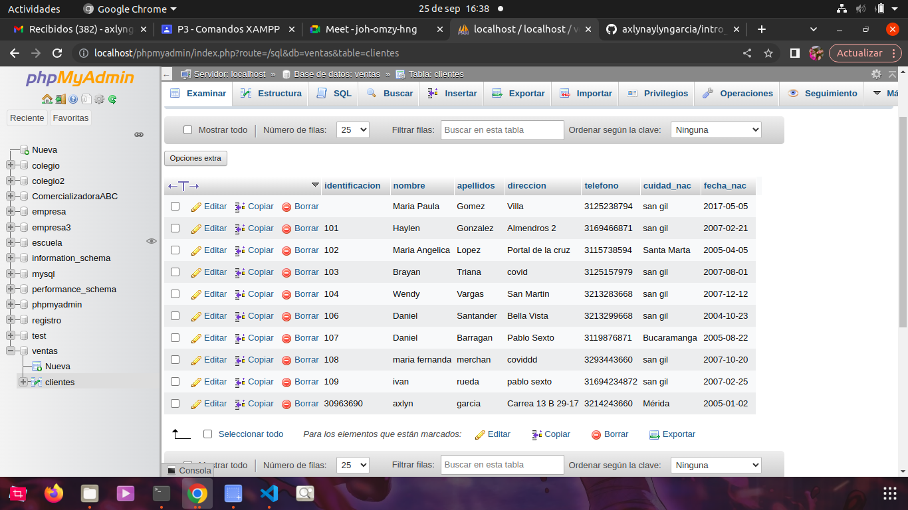

# Introduccion A SQL

1. Creación de una base de datos (BD) con MySQL usando PhpMyAdmin

## Creacion tabla Cliente

###Diccionario de datos
|Campo|Tip de dato|Longitud|
|-----|-----------|--------|
|**\*identficacion**|varchar|15|
|nombre|varchar|20|
|apellidos|varchar|25|
|telefono|varchar|20|
|cuidad_nac|varchar|20|
|fecha_nac|date||

## Código SQL de creacion de la tabla ventas

CREATE TABLE

